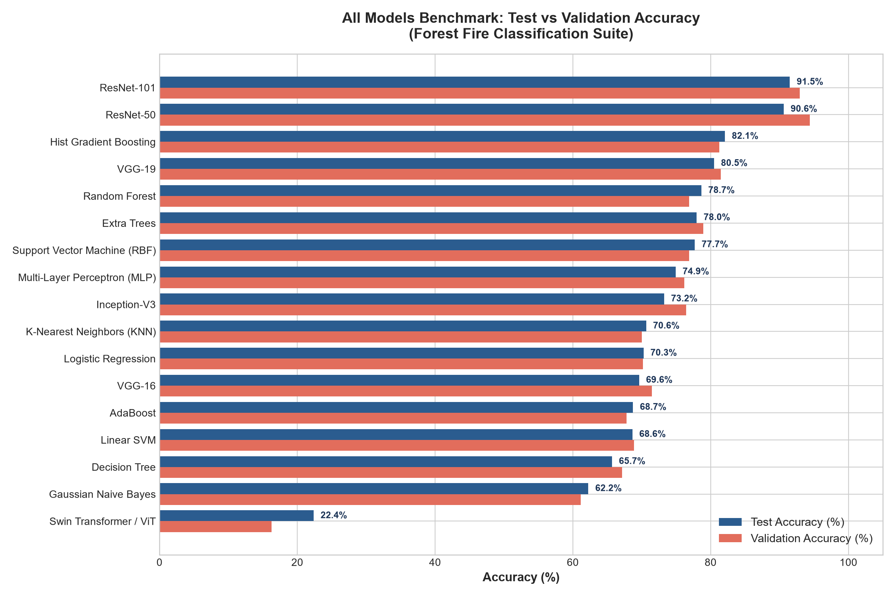
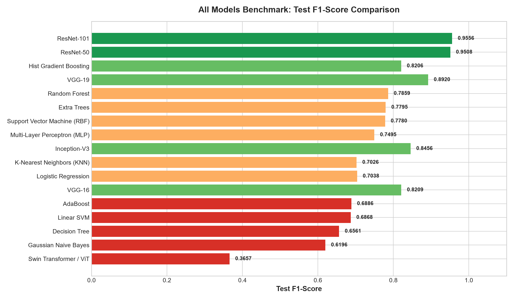
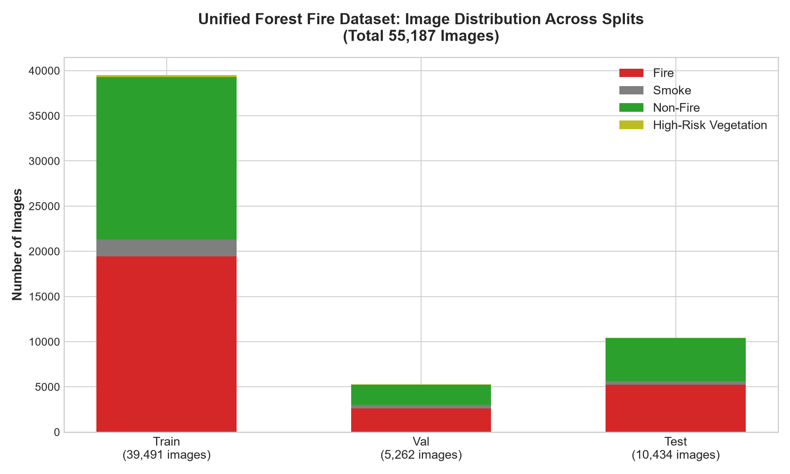

# 🔥 Forest Fire & Smoke Detection: Multi-Model Deep Learning & Machine Learning Benchmark Suite

[](https://www.python.org/)
[](https://www.tensorflow.org/)
[](https://opensource.org/licenses/MIT)

An end-to-end framework and comparative benchmark suite for automated forest fire detection, smoke identification, and wildfire risk assessment from multi-source aerial, terrestrial, and satellite imagery.

---

## 🏆 Benchmark Leaderboard (Top Models)

All 17 models evaluated under identical conditions on the segregated benchmark test set:

| Rank | Model Name | Architectural Family | Training Time | Val Accuracy | Test Accuracy | Test F1-Score | Status |
| :---: | :--- | :--- | :---: | :---: | :---: | :---: | :--- |
| 🥇 **1** | **ResNet-101** | Deep Learning (CNN Residual) | 80.95s | **92.92%** | **91.50%** | **0.9556** | 🏆 Champion |
| 🥈 **2** | **ResNet-50** | Deep Learning (CNN Residual) | 47.45s | **94.38%** | **90.62%** | **0.9508** | 🥈 Runner-Up |
| 🥉 **3** | **Hist Gradient Boosting** | Classical ML (Histogram Tree) | 28.39s | 81.24% | **82.08%** | **0.8206** | 🥉 Best Classical |
| 4 | **VGG-19** | Deep Learning (CNN Deep 19-Layer) | 92.82s | 81.46% | **80.50%** | **0.8920** | Top 4 |
| 5 | **Random Forest** | Classical ML (Bagged Trees) | 1.31s | 76.86% | **78.65%** | **0.7859** | Ultra Fast |
| 6 | **Extra Trees** | Classical ML (Extremely Randomized) | 0.60s | 78.95% | **77.98%** | **0.7795** | Ultra Fast |
| 7 | **SVM (RBF Kernel)** | Classical ML (Support Vector) | 3.67s | 76.86% | **77.69%** | **0.7780** | Robust Baseline |
| 8 | **MLP Classifier** | Neural Network (Multi-Layer Perceptron) | 37.23s | 76.19% | **74.93%** | **0.7495** | Neural Baseline |
| 9 | **Inception-V3** | Deep Learning (CNN Multi-Scale) | 46.06s | 76.46% | **73.25%** | **0.8456** | Factorized Conv |
| 10 | **KNN** | Classical ML (K-Nearest Neighbors) | 0.00s | 70.00% | **70.64%** | **0.7026** | Instant Inference |
| 11 | **Logistic Regression** | Classical ML (Linear Classifier) | 7.71s | 70.19% | **70.26%** | **0.7038** | Linear Baseline |
| 12 | **VGG-16** | Deep Learning (CNN Deep 16-Layer) | 74.24s | 71.46% | **69.62%** | **0.8209** | Deep Baseline |
| 13 | **AdaBoost** | Classical ML (Adaptive Boosting) | 18.03s | 67.81% | **68.73%** | **0.6886** | Adaptive Boost |
| 14 | **Linear SVM** | Classical ML (Linear Support Vector) | 16.56s | 68.86% | **68.64%** | **0.6868** | Linear Margin |
| 15 | **Decision Tree** | Classical ML (CART Decision Tree) | 4.36s | 67.14% | **65.68%** | **0.6561** | Single Tree |
| 16 | **Gaussian Naive Bayes** | Classical ML (Probabilistic Bayes) | 0.05s | 61.14% | **62.25%** | **0.6196** | Probabilistic |
| 17 | **Swin Transformer / ViT** | Vision Transformer (Attention Patches) | 30.35s | 16.25% | **22.38%** | **0.3657** | Transformer |

---

## 📊 Visual Benchmark Comparison

### Model Accuracy (Test vs Validation)


### Model Test F1-Score


### Dataset Image Distribution


---

## 📂 Ingested Datasets

All datasets were downloaded, deduplicated via MD5 hashing, and partitioned into `train`, `val`, and `test` splits:

| Dataset Name | Source Provider | Link |
| :--- | :--- | :--- |
| **Forest Fire Images** | Kaggle | [mohnishsaiprasad/forest-fire-images](https://www.kaggle.com/datasets/mohnishsaiprasad/forest-fire-images) |
| **Forest Fire Dataset** | Kaggle | [alik05/forest-fire-dataset](https://www.kaggle.com/datasets/alik05/forest-fire-dataset) |
| **Fire Dataset** | Mendeley Data | [fcsjwd9gr6/1](https://data.mendeley.com/datasets/fcsjwd9gr6/1) |
| **Satellite Wildfire Detection** | Roboflow | [satellite-wildfire-detection](https://universe.roboflow.com/htw-berlin-xv7eo/satellite-wildfire-detection) |
| **Forest Fire C4** | Kaggle | [obulisainaren/forest-fire-c4](https://www.kaggle.com/datasets/obulisainaren/forest-fire-c4) |

### Dataset Split Statistics (55,187 Total Images)
- **Train Split**: 39,491 images (Fire: 19,455 | Smoke: 1,855 | Non_Fire: 17,971 | High_Risk_Vegetation: 210)
- **Validation Split**: 5,262 images (Fire: 2,612 | Smoke: 397 | Non_Fire: 2,209 | High_Risk_Vegetation: 44)
- **Test Split**: 10,434 images (Fire: 5,220 | Smoke: 398 | Non_Fire: 4,771 | High_Risk_Vegetation: 45)

---

## 🚀 Quickstart & Usage

### 1. Installation
```powershell
pip install -r requirements.txt
```

### 2. List All 29 Available Architectures
```powershell
python main.py --list-models
```

### 3. Run Benchmark on Any Model
```powershell
# SOTA Champion: ResNet-101
python main.py --model resnet101

# High-Performance Runner-Up: ResNet-50
python main.py --model resnet50

# VGG-19
python main.py --model vgg19

# Inception-V3
python main.py --model inception_v3

# Swin Transformer
python main.py --model swin_transformer

# Random Forest
python main.py --model random_forest
```

---

## 📁 Repository Structure

```
├── main.py                    # Unified CLI entry point
├── requirements.txt           # Dependencies
├── know.md                    # In-depth knowledge base & architecture documentation
├── reports/                   # Detailed summary CSVs & high-res benchmark charts
│   ├── all_models_summary.csv
│   ├── dataset_images_summary.csv
│   ├── dataset_sources_summary.csv
│   ├── model_accuracy_comparison.png
│   ├── model_f1_score_comparison.png
│   ├── model_training_time_comparison.png
│   ├── dataset_image_distribution.png
│   └── README.md
├── src/
│   ├── benchmark_runner.py    # Multi-model training and evaluation pipeline
│   ├── evaluation.py          # Dual-backend metrics & confusion matrices
│   ├── trainer.py             # Model training engine
│   ├── explainability.py      # Grad-CAM visualization
│   └── models/
│       ├── registry.py        # Central architecture registry (29 models)
│       ├── resnet.py          # ResNet-18, ResNet-50, ResNet-101
│       ├── vgg.py             # VGG-16, VGG-19
│       ├── inception.py       # Inception-V3
│       ├── vit_ensemble.py    # Vision Transformer & Swin Transformer
│       ├── classical_ml.py    # 11 Classical Scikit-Learn models
│       ├── convnext.py        # ConvNeXt-Tiny, ConvNeXt-Small
│       ├── efficientnet.py    # EfficientNet-B0, EfficientNet-B4
│       ├── densenet.py        # DenseNet-121
│       ├── mobilenet.py       # MobileNetV2, MobileNetV3
│       ├── shufflenet.py      # ShuffleNetV2
│       └── custom_convnet.py  # 5-Layer Custom ConvNet
└── data/                      # Segregated dataset splits
    └── benchmark_dataset/
        ├── train/
        ├── val/
        └── test/
```

---

## 📜 Full Documentation
For complete mathematical formulations, hyperparameter specifics, and per-class precision/recall breakdowns, please see [`know.md`](know.md).
